# Final Topology addon for Blender 3D - 2.2.1

Blender 3D addon that introduces subdivision snapping, retopo and modeling tools from the 21st century.

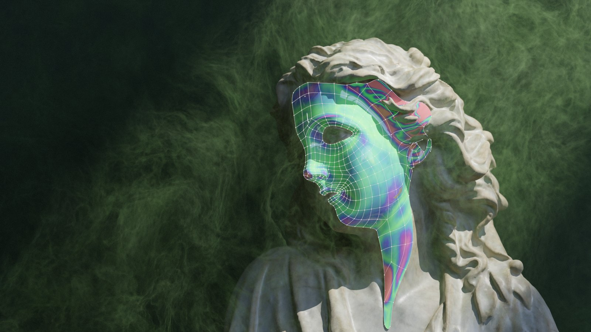

> **Support the development.** Final Topology is open source under the GPL v3, and its development is funded by the people who use it. The easiest way to support it is to get the add-on through Blendkit: [Final Topology on Blendkit](https://www.blenderkit.com/asset-gallery-detail/388b195c-5a7d-4d9f-a632-0dac12c9198c/) with the [Full Plan](https://www.blenderkit.com/plans/pricing/), which also brings automatic updates through the Blendkit add-on and the whole asset library. Bug reports and pull requests are welcome here too.

This Blender 3D addon features many tools that were missing and also organizes some simple, but essential tools for polygonal modeling.
The addon is distributed in two editions:

- **Final Topology for Artists** - the subdivision snapping toolset.
- **Final Topology for CAD professionals** - adds the constraint system for precise, CAD-grade subdivision surface modelling, aimed at professional CAD and automotive industry modellers.

## Final Topology for Artists - features

- **Inverse subdivision snapping**: snaps mesh vertices in edit mode so that if the subdivision modifier is used, the resulting surface is as close as possible to the target surface.
  - Live, or 'Simulation' mode of this tool, which works realtime during modeling
  - Neighbours levels, Number of iterations settings
  - Single step operator that can be called with a shortcut with arbitrary number of iterations
  - Supports offset from the target surface
- **Unsubdivide** - takes a mesh that resulted from a subdivision modifier being applied (in Blender or in any other application) and recreates the original low-resolution mesh.
  - Settings for number of subdivisions and number of iterations of the algorithm. Higher iteration numbers yield more precise results.
- **Shape Freeze** - enables changing the topology of a subdivision surface model while keeping the resulting shape as same as possible.

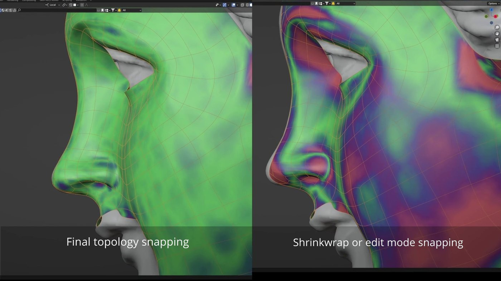

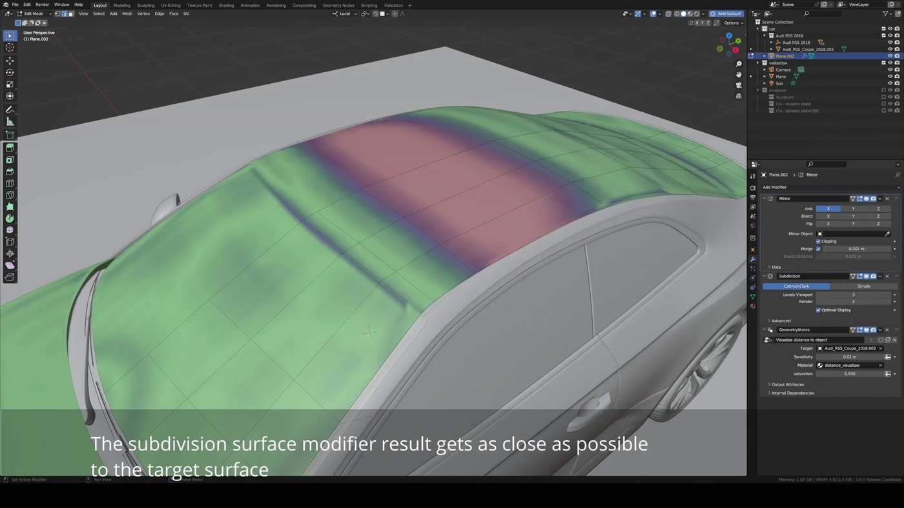

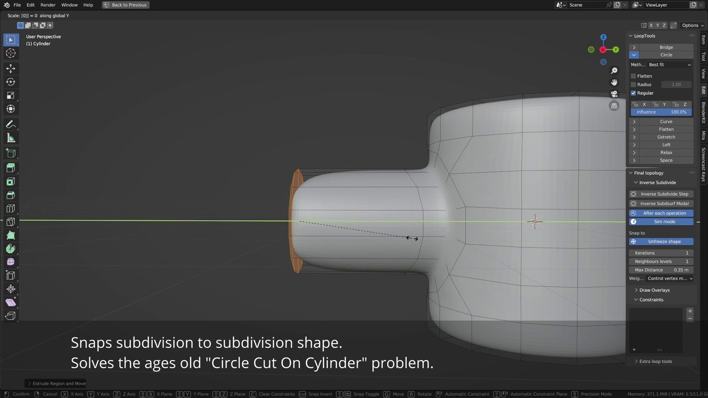

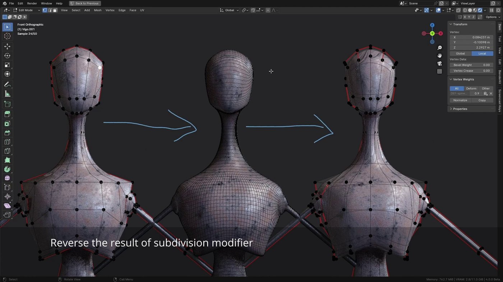

## Final Topology for CAD professionals - features

Everything from the Artists edition, plus the constraint system: edit mode constraints that get evaluated in a loop together with the subdivision surface snapping, so all conditions get optimized toward each other. The main difference compared to various shrinkwrap modifier tricks is that everything converges at once.

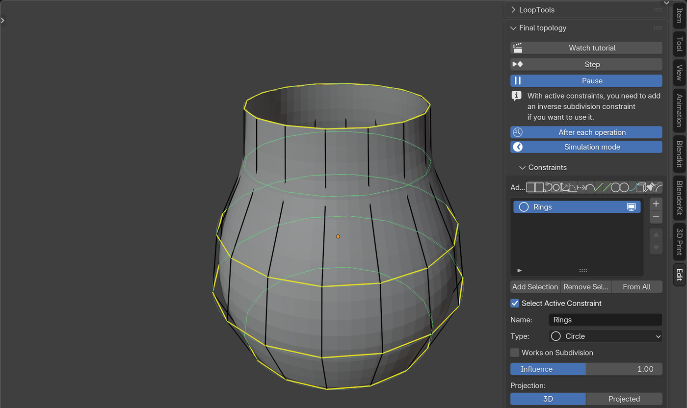

### Constraints

- **Inverse subdivision** - the snapping as a constraint: works on a limited selection and mixes with the other constraints. Snap to the scene, an object or a collection, or freeze the current shape. Boundaries of the constrained area are handled well.

  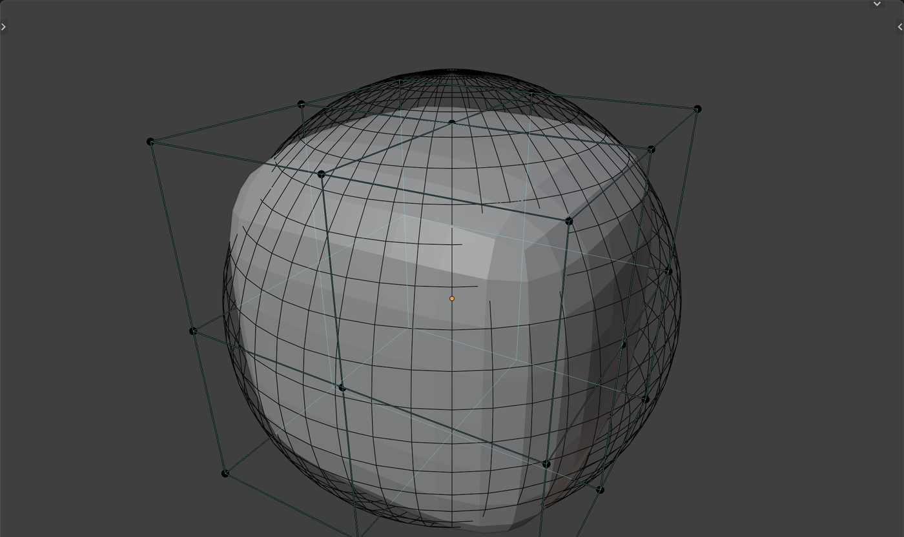
- **Plane** - snaps loops to their best-fit plane, or to a fixed plane with editable center and normal. Join Center / Join Normal make multiple loops share one plane.

  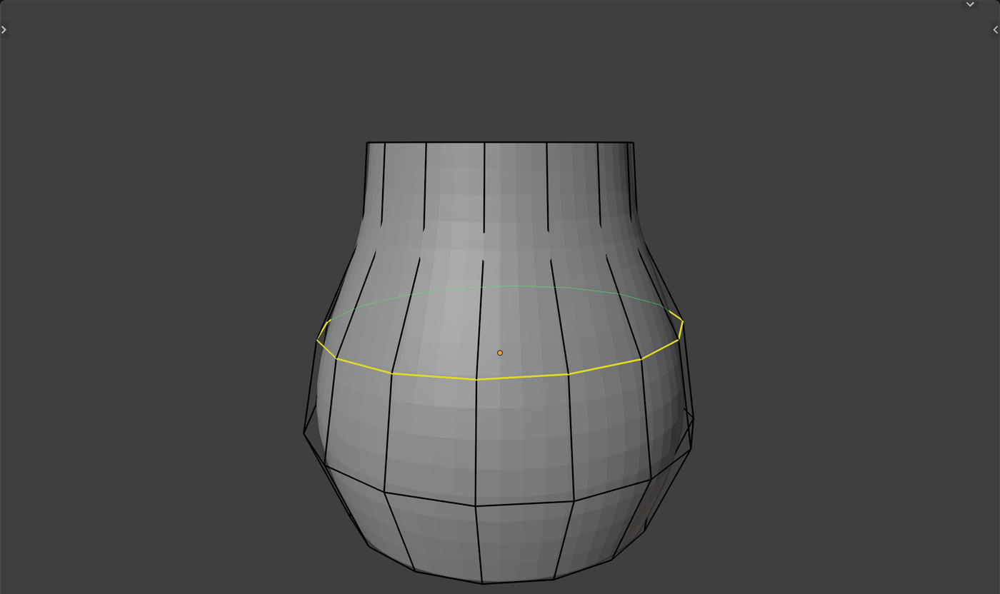
- **Line** - straightens open loops onto the line between their ends, or onto stored fixed lines. Projected mode and even distribution.

  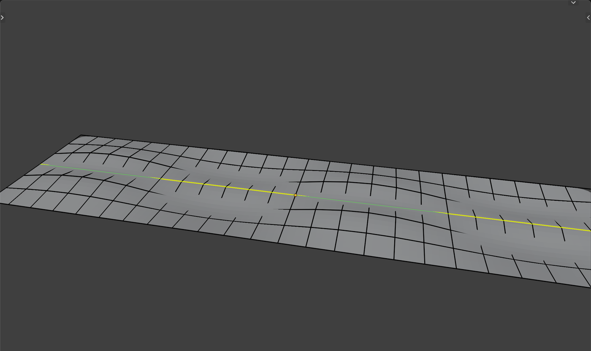
- **Circle** - pulls loops onto their best-fit circles, or onto stored fixed circles; open loops land on arcs. Even distribution, projected mode, Join Center / Join Normal for concentric or coaxial rings, and Same Radius for all circles of the constraint, with or without fixing them.
- **Arc** - open loops settle on circular arcs between their ends. Same Angle sets one sweep for all arcs with the ends staying put, Same Radius one radius with the sweep following from the chord; with both set the ends slide along their chord.

  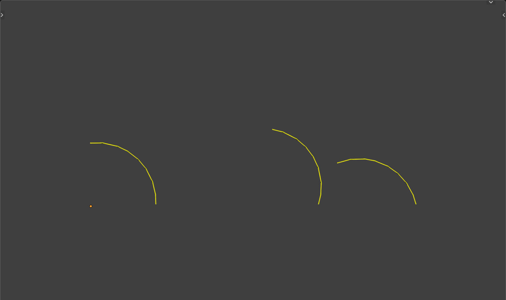
- **Curve** - snaps loops onto a curve object with true bezier evaluation, in 3D or projected onto the curve plane, optionally evenly distributed.

  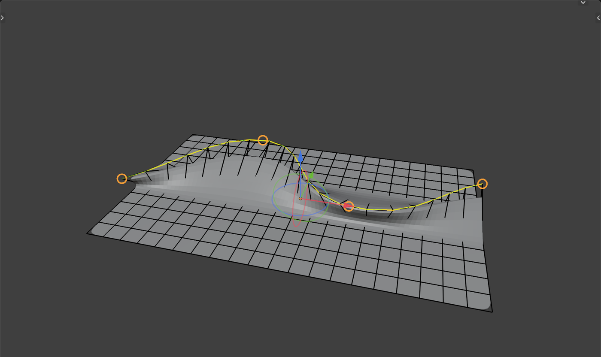
- **Space** - spaces vertices along loops by local Blur (the default, settles around pinned vertices), evenly, or with a Same Ratio progression, sliding along arc, cubic or linear interpolation of the loop shape. Ring Width mode evens out the widths of edge rings instead, e.g. support loops.

  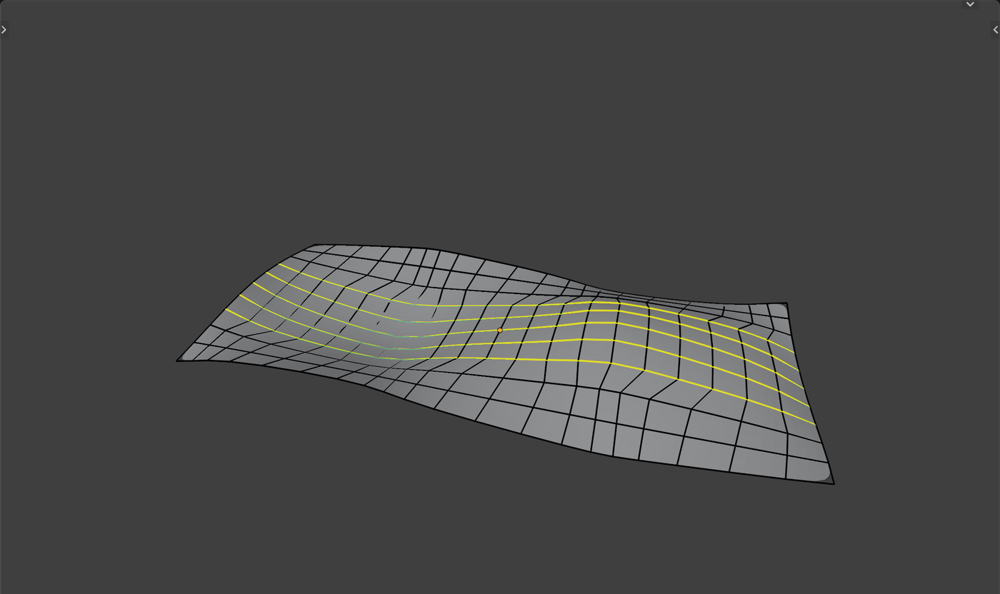

  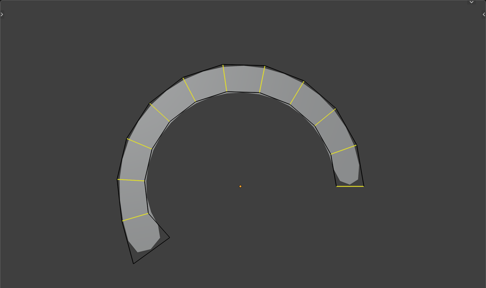
- **Curvature** - evens out the curvature along loops, measured by arc length or turn angle, aiming for a blurred (default), constant or linearly changing profile, optionally sampling the loop's surroundings. Direction picks the in/out bending against the surface, the turning on the surface (corrected by sliding along the crossing edges, so narrow bands never fold), or both as two separate curvatures. Same Turn evens each same-direction bow on its own, Bridge Poles continues loops through the poles and corners they end on. An overlay draws every measured angle as a wedge with its hinge.

  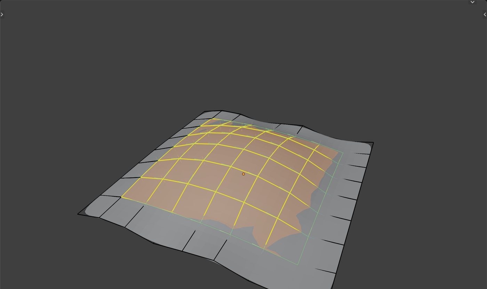
- **Thickness** - keeps the wall thickness under the vertices within minimum/maximum bounds, measured by rays cast against the mesh itself. Colored face overlay shows too thin, fine and too thick areas.
- **Smooth** - three modes: Blend melts the region into its surroundings like a soap film, Keep Shape filters jaggedness while preserving the form, and Round (default) fairs the region into a curvature-continuous blend, solving its equations directly on open patches so a pinned vertex shapes a smooth surface through itself.

  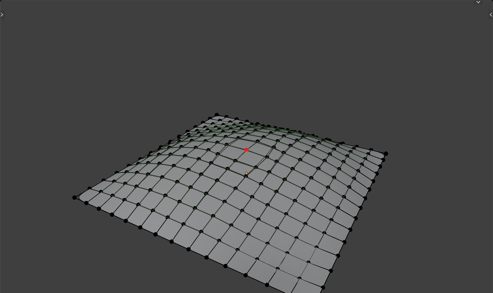
- **Slide optimize** - slides vertices along a loop so that the angles on both sides of a vertex get equalized.
- **Inclination limit** - limits how far faces may lean away from a chosen axis, the direction the shape rises toward, for printing or manufacturing. A cone overlay shows the steepest allowed faces and the overhang range, and two handles on its rim set the limit in the viewport. Six axis presets or a custom vector.

  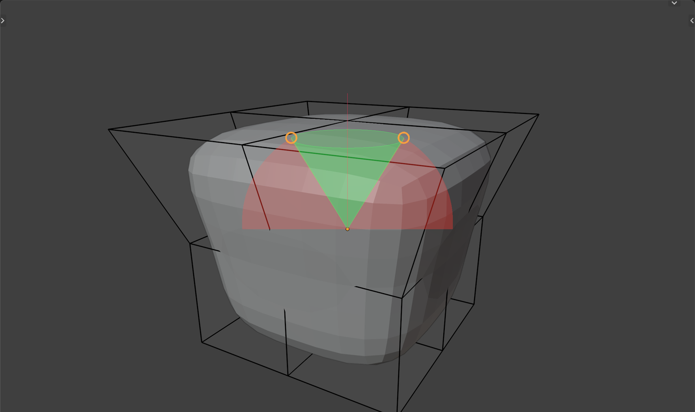
- **Pin** - freezes vertices against all constraints and inverse subdivision; only your own transforms move them.

### Pins shape the fits

Pinned vertices count as the truth: in the circle, plane, line and arc fits each pin weighs as much as the whole loop, so the free vertices come to the pins instead of the pins standing off as outliers. Two pins with Even distribution place a circle outright so that every segment comes out equal, three or more pins lay the spacing out between them. Pins draw as red squares while the solver runs, sized after the theme's vertex size.

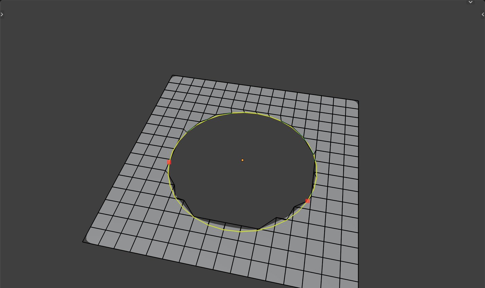

### Loops

Edge constraints split their assigned edges into loops the way Blender's loop select does. Stop at Poles, Stop at Turns and Stop at Crease (a creased edge touching the loop from the side ends it) are on by default, off for planes, and not offered for circles and arcs, which take their loops as assigned. The decomposition does not depend on the order the edges were assigned in.

### Constraint workflow

- Every constraint has an Influence factor on top of the global step weight, to balance constraints fighting over the same vertices, and can work on the cage or on its subdivided positions (Works on Subdivision).
- Transform gizmos for fixed planes, fixed circles, target curves and the inclination cone, following Blender's transform orientation setting.
- Curve control point handles: edit the target curves of all curve constraints without leaving the mesh. Control points lying on the same spot - also across different curves - share one handle and move together. Dragging a handle runs Blender's native transform, so snapping, axis locking and numeric input all work; a single tweak returns to the mesh automatically and longer curve editing sessions come back via the Back to Mesh button.
- Create a curve object directly from a constraint's loop, as a NURBS (default) or bezier curve, from the original vertices or a chosen best-fit point count.
- Shortcuts: **Shift+P** pins the selection, **Alt+P** unpins it. **Alt+C** opens a menu that adds the selection to any constraint, or to a new one from its submenu, without activating the constraint first; **Shift+Alt+C** removes it from a chosen constraint or from all. The Select Active Constraint checkbox under the list controls whether clicking a constraint selects its elements.
- Constraints can be reordered, and every constraint action - adding, deleting, assigning, property changes - undoes with a single step.
- Mirror modifier support: mirror seams stay on their mirror planes and circle fits come out symmetric at the seams.
- Colored overlays visualize constraint targets, measured angles and the remaining deviation while the solver runs; Overlays Alpha fades them all, pins at double strength.

### Additional tools

- **Loop align to normal plane** - takes a loop and aligns it to a plane that is aligned with its normals' directions.
- **Loop slide optimize** - balances the angles between the edges of a loop.
- **Flatten selection** - simple flatten to median plane operator (similar to LoopTools).
- **Print-safe tools** - checks aimed at 3D-printable output.

## Videos

[](https://www.youtube.com/watch?v=-ha_HeSoavA)

- [Final Topology Blender add-on](https://www.youtube.com/watch?v=-ha_HeSoavA) - overview
- [Final Topology Blender add-on tutorial](https://www.youtube.com/watch?v=5JWf-B89msU) - the tutorial the panel's Watch Tutorial button opens
- [A new approach to Retopology](https://www.youtube.com/watch?v=7AR9-LxY6AQ) - the Blender Conference talk on the idea behind the add-on

## Download and support

The source is here for everyone to read, build and improve. Building it yourself works with `build.py --all`, and you can install the archive from `out/` as an extension.

If Final Topology saves you time, please get it through Blendkit and keep the development going: [Final Topology on Blendkit](https://www.blenderkit.com/asset-gallery-detail/388b195c-5a7d-4d9f-a632-0dac12c9198c/) is part of the [Full Plan subscription](https://www.blenderkit.com/plans/pricing/). Subscribers get both editions, updates through the Blendkit add-on, and the full asset library, and every subscription funds the next features and fixes in this repository.

## Support

If you face any bug, please create a report in this repository's issue tracker: https://github.com/BlenderKit/final_topology/issues.
If your bug is related to a specific model or project and a .blend file is required to debug the problem, please create the issue here and also send the .blend file to admin@blendkit.com with a subject mentioning the issue number and/or title.

## Development

The regression suites live in `tests/` and run the real operators in background Blender:

```bash
tests/run_all.sh
```

Pass a file name to run a single suite, and set `BLENDER` to another binary if needed. Every suite prints PASS/FAIL lines and ends with ALL PASSED or FAILURES. `build.py --all` builds both editions into `out/`.

## License

Final Topology is free software under the GNU General Public License, version 3 or later. See [LICENSE](LICENSE).

## Basic instructions

After installing the addon, find it in the Edit tab of the Sidebar in 3D view.
Read the tooltips directly in the add-on - every button should have enough info to use the tool.

### Quick start

You need to have a mesh with a Subdivision Surface modifier on it. Turn on the Inverse-Subsurf modal or run single optimization steps - the mesh snaps so its subdivided surface matches the surrounding geometry. In the CAD professionals edition, select loops and add constraints from the Constraints panel; they are solved together with the snapping on every step.
